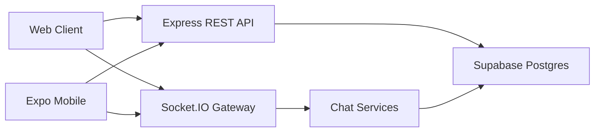

# Chat App Architecture

## System Architecture

The Phase 1 platform is a monorepo with three apps sharing one backend contract:

- Web client: React + Vite in `client`.
- Mobile client: Expo React Native in `mobile`.
- Backend: Express + Socket.IO in `server`.
- Database: Supabase/Postgres using `supabase/chat_schema.sql`.

The backend owns authentication, authorization, database access, and realtime events. Clients talk to REST APIs for durable state and Socket.IO for active-session realtime updates.

## Folder Structure

- `server/src/routes`: HTTP route modules.
- `server/src/services`: business logic shared by REST and Socket.IO.
- `server/src/middleware`: JWT auth, admin guard, and error handling.
- `client/src/components`: web chat UI components.
- `client/src/lib`: web API, socket, chat helpers, and WebRTC foundation.
- `mobile/app`: Expo Router screens.
- `mobile/src`: mobile API, socket, auth state, components, and call placeholders.
- `supabase/chat_schema.sql`: database objects, constraints, indexes, and RLS enablement.

## Database Explanation

`chat_users` stores phone login identities and profile data:

- `id`, `phone`, `name`, `avatar_url`, `about`, `last_seen_at`, `is_online`, `created_at`, `updated_at`.
- A `role` column is added for admin API protection.

`contacts` stores a user-owned address book relationship.

`conversations` stores direct and group threads. `conversation_participants` stores membership and per-user read state.

`messages` supports:

- text, image, video, document, audio, and location message types.
- replies via `reply_to_message_id`.
- forwarded messages via `is_forwarded`.
- deleted messages via `is_deleted` and `deleted_for_everyone`.

`message_status` stores per-user delivery state: `sent`, `delivered`, and `read`.

`call_logs` stores Phase 1 call lifecycle records. `blocked_users` enforces user-level privacy rules in backend services.

Indexes are included for phone search, conversation listing, message pagination, message status lookup, calls, and blocked-user checks.

## Realtime Flow

1. Client requests OTP in either `signin` or `signup` mode.
2. Backend checks account existence: sign in requires an existing phone, sign up requires a new phone.
3. Client verifies OTP and receives a JWT.
4. Client connects to Socket.IO with the token in `auth.token`.
5. Server verifies the token and joins the socket to `user:{userId}`.
6. Client joins active conversations with `conversation:join`.
7. Messages, typing, presence, and calls are sent only to user or conversation rooms.

Socket.IO is used only while the app is active. Push notifications should be added later with FCM for Android/Web and APNs for iOS.

## Message Status Flow

1. Sender creates a message through REST or `message:send`.
2. Backend inserts the message and creates `message_status` rows for participants.
3. Server emits `message:new` to `conversation:{conversationId}`.
4. Receiver marks the message delivered with `message:delivered`.
5. Receiver marks it read with `message:read`.
6. Server emits `message:status` to the conversation room.

Status updates are monotonic in the service layer, so a `read` message is not downgraded to `delivered`.

## Call Signaling Flow

1. Caller starts a call with `POST /api/chat/calls/start`.
2. Caller emits `call:offer` with `to_user_id`, `conversation_id`, `call_id`, type, and offer payload.
3. Receiver gets `call:incoming` and `call:offer`.
4. Receiver emits `call:accepted` or `call:rejected`.
5. If accepted, receiver emits `call:answer`.
6. Peers exchange `call:ice-candidate`.
7. Either peer emits `call:ended`; backend can close the call log through `POST /api/chat/calls/end`.

Web includes browser WebRTC scaffolding with local media preview. Mobile includes placeholder signaling helpers and TODOs for `react-native-webrtc`.

## Security Notes

- All chat APIs except OTP request/verify require JWT validation.
- Sign in and sign up are separate OTP flows. Unknown phones cannot sign in, and existing phones cannot sign up again.
- Admin APIs require `chat_users.role = 'admin'`.
- Backend service methods verify conversation participation before reads/writes.
- Message sending checks blocked users.
- Inputs are validated with Zod in routes/services.
- Supabase service role is used only on the server.
- No secrets are hardcoded.

End-to-end encryption is not implemented in Phase 1. Do not represent Phase 1 messages as E2EE. A future E2EE design should use Signal Protocol or another audited encryption library, with careful key lifecycle, device management, backup, recovery, and security review.

## Media Upload Architecture

Phase 1 has placeholder media endpoints:

- `POST /api/chat/media/upload`
- `GET /api/chat/media/:id`

Production media should use Supabase Storage buckets, signed upload URLs, MIME/size validation, antivirus or content scanning where required, and storage policies that match conversation membership.

## Local Demo Mode

If `SUPABASE_URL` and `SUPABASE_SERVICE_ROLE_KEY` are missing, the server falls back to an in-memory demo store. This supports the preloaded test users, direct chats, group chats, text messages, edit/delete/forward/reply metadata, and media placeholder messages.

This is intentionally not production persistence. It exists so the UI and realtime flows can be tested locally without a Supabase project.

## Notification Foundation

The web client can request browser notification permission from the chat header. Production notifications still need a push channel:

- Web Push for browsers.
- FCM for Android.
- APNs for iOS.
- Server-side fanout for offline recipients.

Socket.IO remains the active-session realtime path.

## Admin Foundation

Admin APIs expose:

- total users
- total conversations
- total messages
- active users today
- recent call logs
- reported users placeholder

The web client shows this in a protected placeholder panel for users with role `admin`.

## Future Roadmap

- Real OTP provider integration.
- Push notifications with FCM/APNs.
- Full media upload and storage policies.
- Full voice/video calling with TURN server.
- Group calls.
- End-to-end encryption.
- Message search.
- Archived chats.
- Starred messages.
- Disappearing messages.
- Broadcast channels.
- Business accounts.
- Payment integration.
- Moderation and report system.
- Scalable deployment with Redis adapter for Socket.IO.
